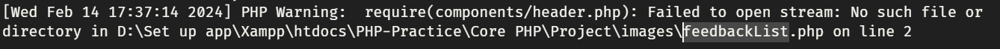
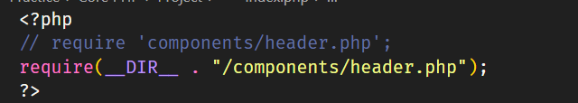

# PROJECT PHP WITH MYSQL
### CDN BOOTSTRAP

<!-- Latest compiled and minified CSS -->
<link rel="stylesheet" href="https://maxcdn.bootstrapcdn.com/bootstrap/3.4.1/css/bootstrap.min.css">

<!-- jQuery library -->
<script src="https://ajax.googleapis.com/ajax/libs/jquery/3.7.1/jquery.min.js"></script>

<!-- Latest compiled JavaScript -->
<script src="https://maxcdn.bootstrapcdn.com/bootstrap/3.4.1/js/bootstrap.min.js"></script>

### CONNECT TO DB

`D:\Set up app\Xampp\mysql`

+ If you want mysql to work then you use command

`set path=%PATH%;D:\Set up app\Xampp\mysql\bin;`

`mysql -u root -p`

        ```
        show databases;
        
        ```

If you see this bug, you can use this code





You can use `__DIR__`

__DIR__ là một hằng số trong PHP, đại diện cho đường dẫn tuyệt đối của thư mục chứa file hiện tại. Nó giúp đơn giản hóa quá trình xác định đường dẫn tuyệt đối, đặc biệt là khi bạn cần kết hợp đường dẫn với tên file hoặc thư mục.

Khi bạn sử dụng __DIR__, bạn có thể chắc chắn rằng đường dẫn sẽ luôn là đường dẫn tuyệt đối, không phụ thuộc vào nơi file đó được gọi. Điều này làm cho mã nguồn của bạn linh hoạt hơn và tránh các vấn đề có thể phát sinh khi bạn di chuyển mã nguồn của mình giữa các môi trường khác nhau.